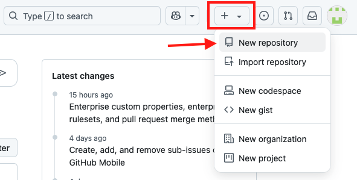
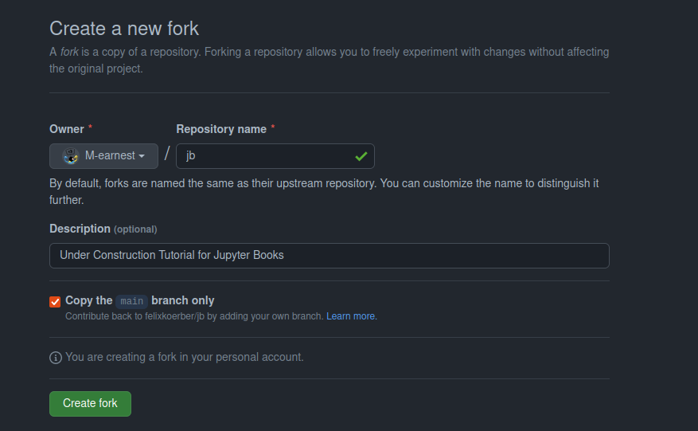

# Setting Up a Repository on GitHub

In this section, you'll first learn how to start a new project on GitHub, followed by short guide on how to use the free course template for your own course. By using our course template instead of starting a completely new project, you can take advantage of the existing structure and only need to customize and add individual pages to fit your content. 

## Create a New Repository
Now, let's put that new account to use by creating an online repository — often called a "remote repo"! 

1. Open Github in your browser

2. Click on the `+` sign in the top right corner and click "New repository"

4. Fill out the repository details: Give your repository a name, description, and check the box next to "public" to make sure others can find your directory. 

This could look something like this:

4. Check the box "Add a README file", this will initiate your repository with a file that can later be used to display basic information to others viewing your repo.

5. Choose a license! You can start out with "None" as this repo is just for testing, but if you plan to use Github for your projects it's imperative to include one to prevent misuse.

6. Click the "Create repository" button to create your new repository.

7. Now you can add files to your repository by clicking the "Add file" button by either uploading them or creating a new file.

Congratulations! You are now the proud owner of a GitHub repository. 

## Forking the Course Template

To work with our materials, you need to "fork" (i.e., copy) the course template repository to your account. Therefore, head over to the [course template repo](https://github.com/DiLER-Digitell/Course-template), and on the upper right-hand side, click "Fork". 

You'll be asked to create a new fork; simply add a new repository name, provide a short description, or keep the existing one, check the box "Copy the main branch only," and click the "Create fork" button.

Now you created your own course repository!

#### Next Section:
In the next section, you will explore the course template's structure and learn how to make your first customizations.
