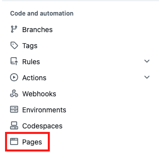
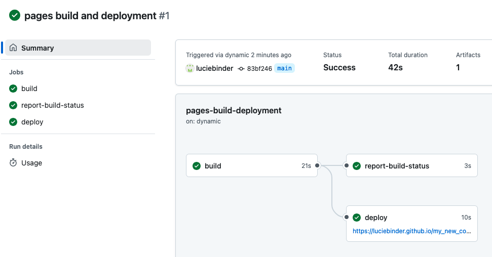

# Hosting Your Course Website

Now that you have created your own repo or forked the template, you will learn how to actually turn your course files into a website. To do this, we'll be using **Github Pages**. GitHub Pages allows users to host websites directly from their GitHub repos, creating a website for their personal portfolio, project documentation, or, in this case, course content. 
The website is generated directly from the contents of your GitHub repo and is automatically updated whenever changes are made to the repository. 

## Goals
This chapter aims to include the following goals:

1. Learn how to host a website using GitHub pages
2. Learn some common error warnings and how to troubleshoot them 

## Setting up GitHub Pages
Normally, you'd have to set up a ["GitHub-pages-actions"](https://github.com/marketplace/actions/github-pages-action) script for the website to be automatically built on push, but the course template already contains everything you need. 

If we take a closer look at the `.github/workflows` folder, we'll find a file called `book.yml`. This file already contains all the instructions necessary for GitHub to build your book automatically. All we need to do now is change a few of the settings of our online repo. 

### Setting Up Your Website

**1.Open your repository in your browser and click on "Settings" in the top tab, located on the far right.**

**2. Click on "Pages" under "Code and automation" on the left side.**

**3. Under Source, select "Deploy from a branch"**

**4. Under Branch: Select branch "master" and select the "/root" folder and save**

**5.Push a new commit to your repo, i.e. make a change to one file (e.g., add a line to your README.md)**

### Checking Your Workflow

Next, if you click on "Actions" at the top of your repository, you should see that a workflow called "pages and deployment" is running. In this image, the process has been completed, as indicated by the green checkmark:

### Getting Your Link

Once that process has been completed head back over to "Settings" -> "Pages". At the top, under "GitHub Pages", you should now find a field that looks like this:

Clicking on the displayed link should lead you to your newly built content site. Now, you can simply copy that link and add it to your repos README.md, so people can actually find your website.
Done!

## Next Section:
In the next section, you will how to identify failed workflows and how to troubleshoot common errors.
