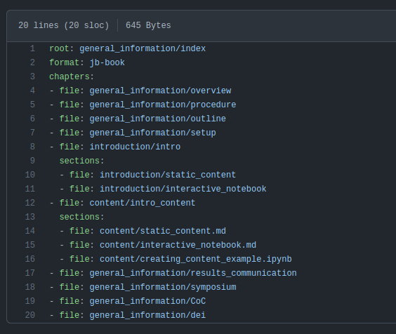

# Structuring Content Using the Table of Contents

In order to build your book, Jupyter Book needs to know how you want to structure the content that you have created, that is: 

* **Which files should be displayed on your website?**
* **In which order should the pages appear?**
* **In what form should the content be displayed?**

The answers to these questions are written in a `YAML` file called `_toc.yml`, which defines the **Table of Contents** (ToC), as well as the formatting of your book. It can be found in, e.g., the lecture folder of the [template](https://github.com/DiLER-Digitell/course-template). The `_toc.yml`, therefore, defines the structure of your course website. 

In the simplest form, the `_toc.yml` looks like this:

```
format: jb-book
root: index
chapters:
- file: path/to/chapter1
- file: path/to/chapter2
  sections:
  - file: path/to/chapter2/section1
```

While this might seem overwhelming at first, it is actually really simple. Below, you'll find a short description of the keys. Keys are words, helping Jupyter Book to understand what you are expressing in the ToC.

|Key|Description|
|---|---|
|`format`|Format defines how the ToC will be interpreted. For our purposes, `jb-book` is the appropriate option.|
|`root`|Root defines the landing (aka first) page of your book.|
|`chapters`|Contains a list of files. No argument is needed here|
|`file`|Path to the files that you want to include in your book. All the paths are relative to the root.|
|`sections`|Defines sections of a chapter.|

Furthermore, you can also **subdivide chapters into parts** using the `parts:` argument:

```
format: jb-book
root: index
parts:
  - caption: Name of Part 1
    chapters:
    - file: path/to/part1/chapter1
    - file: path/to/part1/chapter2
      sections:
      - file: path/to/part1/chapter2/section1
  - caption: Name of Part 2
    chapters:
    - file: path/to/part2/chapter1
    - file: path/to/part2/chapter2
      sections:
      - file: path/to/part2/chapter2/section1
```

|Key|Description|
|---|---|
|`parts`|Parts can further subdivide and group chapters and, thus, consist of a list of chapters.|
|`caption`|Name of the parts.|


```{note}
The chapter names displayed on your website are defined by the top-level heading of the respective file. For instance, for this page, the top-level header looks like this: `# Structuring Content Using the Table of Contents` 
```

#### Adapting the toc.yml/Table of Contents

To add your course content, simply provide the path to your newly created or adapted file, including the respective filename to this document. For this, you can simply copy-paste the existing lines of the provided "toc.yml" and exchange the example filenames with your own filenames. It is further easiest if you simply adapt the `index.md` file provided with our template as the `"root"`, i.e. the landing page of a website.

In practice, the provided structure for our template looks like the following. 

Where our ["toc.yml"](https://github.com/DiLER-Digitell/Course-template/blob/main/lecture/_toc.yml) looks like this:



and results in this site layout:


___

While this should cover the basics, feel free to check out [Jupyter Book's Manual](https://jupyterbook.org/en/stable/structure/toc.html) for further information.


### Next Section:
In the next section, we will recap what you have learned in this course and provide information on how to reach us if you encounter any issues.
